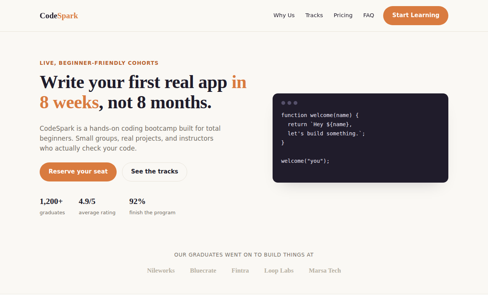
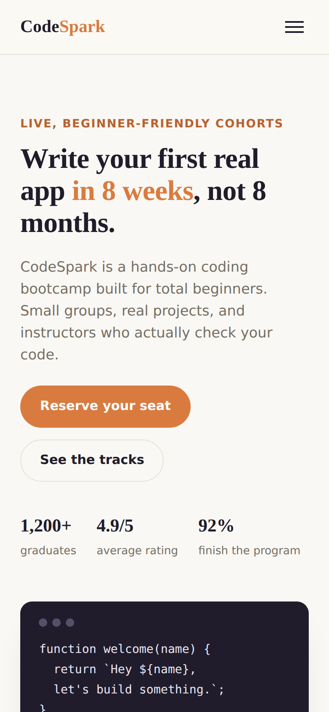

# CodeSpark — Bootcamp Landing Page

A responsive marketing landing page for "CodeSpark," a fictional coding bootcamp. Built as a front-end portfolio project to practice layout, responsive design, and interactive UI details without a framework.

**Live demo:** https://codespark-landing-page.vercel.app/

<p align="center">
  
  &nbsp;
  
</p>

## Features

- Responsive hero, features, pricing, testimonials, and FAQ sections
- Mobile navigation menu with toggle
- Accordion-style FAQ using native `<details>`/`<summary>`
- Fully responsive layout (desktop, tablet, mobile)
- No frameworks — plain HTML, CSS, and JavaScript

## Tech Stack

- HTML5
- CSS3 (Grid & Flexbox, custom properties)
- Vanilla JavaScript

## Running locally

Just open `index.html` in a browser, or serve it locally:

```bash
npx serve .
```

## Deploying

This is a static site — drag-and-drop the folder into Netlify, or import the repo into Vercel with no build command needed.

## Author

Eng. Sabah Gomaa — [GitHub](https://github.com/Engsabah37) · [LinkedIn](https://www.linkedin.com/in/sabah-gomaa-90a8361b7)

## License

[MIT](LICENSE)
